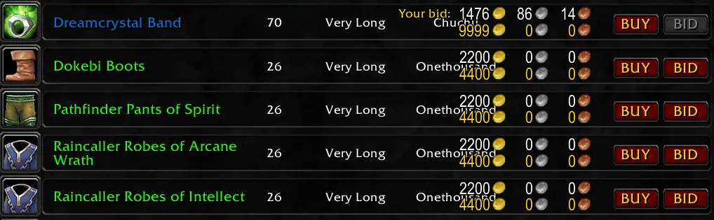

# Synastria AH Buyer

A small World of Warcraft: Wrath of the Lich King 3.3.5a addon that adds an instant **BUY** button to each visible Auction House browse row.

## Preview



## Features

- One **BUY** button on every visible auction row
- Purchases the auction on that row without the normal confirmation popup
- Rechecks the auction and buyout price when clicked
- Disables buying for bid-only auctions, your own auctions, and auctions you cannot afford
- Works correctly while scrolling through search results

## Installation

### Release ZIP

The easiest option is to open the [latest release](https://github.com/scoufman/synastria_ah_buyer/releases/latest) and download the attached `synastria_ah_buyer-v1.1.zip` file.

Extract the ZIP and copy its `synastria_ah_buyer` folder into your WoW AddOns directory.

### Source code ZIP

You can also use GitHub's **Code → Download ZIP** option. Extract the repository archive, then copy the inner `synastria_ah_buyer` folder into your WoW AddOns directory.

The source archive is arranged like this:

```text
synastria_ah_buyer-main\
├── README.md
└── synastria_ah_buyer\
    ├── synastria_ah_buyer.toc
    └── SynastriaAHBuyer.lua
```

After either installation method, your WoW installation should contain:

```text
World of Warcraft\Interface\AddOns\synastria_ah_buyer\
├── synastria_ah_buyer.toc
└── SynastriaAHBuyer.lua
```

Restart the client or use `/reload` after updating the addon.

## Usage

1. Open the Auction House.
2. Search for an item.
3. Click **BUY** on the auction row you want.

The purchase is submitted immediately. You do not need to select the row first.

## Warning

There is no confirmation popup. Clicking **BUY** attempts to purchase that auction immediately and cannot be undone. The server may still reject the purchase if the auction has expired or another player bought it first.

## Compatibility

- World of Warcraft 3.3.5a
- Addon interface version `30300`
- Addon version `1.1`
